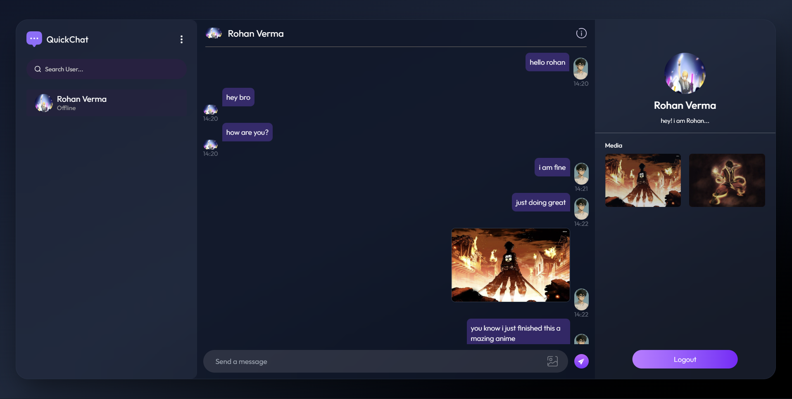

# 💬 QuickChat – Real-Time Full Stack Chat Application

**Connect instantly with people using a fast, secure, and modern real-time chat platform.**

*QuickChat enables seamless one-to-one communication with real-time messaging, authentication, and a responsive UI powered by the MERN stack and Socket.io.*

  
  &nbsp;
  

---

## ✨ Core Features

QuickChat is designed to deliver fast, secure, and real-time communication with a modern tech stack.

| Feature | Description | Technology Used |
|-------|-------------|-----------------|
| 💬 **Real-Time Messaging** | Instant bi-directional communication between users. |  |
| 🔐 **Authentication** | Secure login and session management using tokens. |  |
| 👤 **User Profiles** | Create and manage user accounts with profile data. |  |
| 📎 **Media Sharing** | Share images and files inside chats. |  |
| 📱 **Responsive UI** | Smooth experience across mobile & desktop devices. |   |
| 🚀 **Scalable Deployment** | High-performance hosting and fast builds. |  |

---

## 🛠️ Tech Stack

Built with a scalable and production-ready MERN architecture.

- **Frontend:** React.js (Vite)
- **Styling:** Tailwind CSS
- **Backend:** Node.js, Express.js
- **Database:** MongoDB
- **Real-Time Engine:** Socket.io
- **Authentication:** JWT
- **Deployment:** Vercel

---
